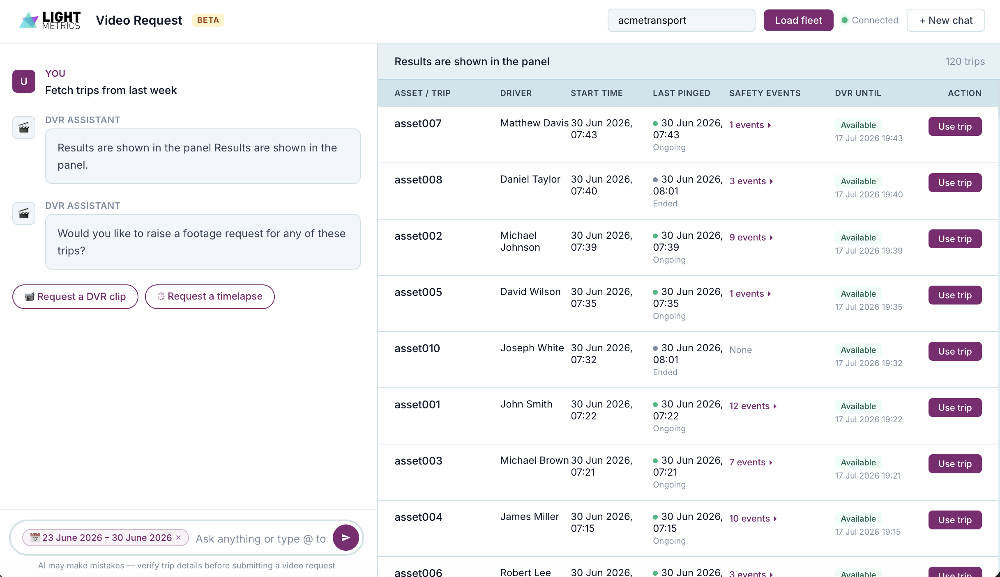
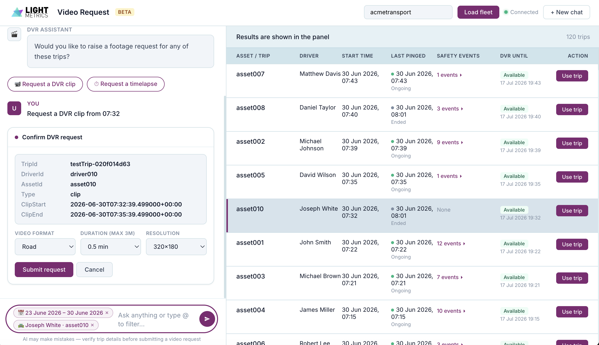

# DVR Fleet Video Request Assistant

<!--  -->

## Overview

A FastAPI + LangGraph-based conversational assistant that helps fleet managers search trips, apply filters, and submit DVR (Digital Video Recorder) video requests through the LightMetrics API. Communication happens over WebSockets, with a vanilla JS frontend featuring filter chips, `@` mention autocomplete, and a split-panel trip results canvas.

## Key Commands

### Development Setup

```bash
# Create and activate virtual environment
python3 -m venv myenv
source myenv/bin/activate  # Linux/Mac

# Install dependencies
pip install -r requirements.txt

# Run the FastAPI application
python main.py
```

## Architecture

### Request Flow

The assistant uses a LangGraph StateGraph with the following node pipeline:

```
User Query → Extract Filters → Check Timestamp → Fetch Trips → Show Results
                                                                     ↓
                                              Extract DVR Intent ← User Input
                                                     ↓
                                        ┌────────────┼────────────┐
                                   show_trips    dvr_request   general_question
                                        ↓            ↓               ↓
                                  Merge Filters  Confirm DVR    LLM Answer
                                        ↓            ↓
                                  Show Results   Submit DVR → END
```

### Intent Classification

User messages are classified into three intents after trips are displayed:

- **show_trips**: User wants to narrow/change filters — triggers `merge_filters_from_text`
- **dvr_request**: User wants to request a video clip or timelapse — triggers DVR confirmation flow
- **general_question**: User asks a question about the displayed trips — answered by LLM

### Filter Extraction

Filters are extracted via structured LLM output (`ExtractedFilters`) and include:

- Driver name (fuzzy-matched against fleet driver list)
- Event type (e.g. harshBraking, speeding)
- Asset ID, Trip ID
- Date range (start/end time)
- `limit_to_latest` (count-based slicing vs time-window)

### DVR Request Flow

<!--  -->

1. User selects or mentions a trip
2. Assistant extracts clip type (clip/timelapse), start/end times
3. Parameters are validated against trip bounds and duration limits (3 min clip, 60 min timelapse)
4. User confirms via inline card with format, resolution, and duration options
5. Request is submitted to `/fleets/{fleetId}/dvr/create-upload-request`

## Module Organization

```
├── main.py                    # FastAPI server, WebSocket handler, route definitions
├── index.html                 # Frontend UI
├── static/                    # Static assets (logo, images)
├── DVR_code/
│   ├── Graph_code.py          # LangGraph StateGraph — all nodes and routing logic
│   ├── state.py               # AgentState schema (Pydantic)
│   ├── prompt.py              # System prompts for intent, filter extraction, Q&A
│   ├── fetch_data.py          # LightMetrics API calls (trips, drivers)
│   └── helper_function.py     # Filter utilities, driver matching, date helpers
├── logger.py                  # Structured logging (access + debug, rotating files)
└── requirements.txt           # Python dependencies
```

## Environment Variables

```bash
# OpenAI
OPENAI_API_KEY

# LightMetrics API
LM_API_URL
LM_ACCESS_TOKEN
LM_ID_TOKEN

# Supabase
SUPABASE_URL
SUPABASE_KEY

# Qdrant
QDRANT_URL
QDRANT_API_KEY

# LangSmith (observability)
LANGSMITH_API_KEY
LANGSMITH_TRACING
LANGSMITH_PROJECT
```

## WebSocket Protocol

All communication happens over a single `/chat` WebSocket connection.

### Client → Server

| `type`              | Purpose                          |
|---------------------|----------------------------------|
| `load_data`         | Send fleet metadata on connect   |
| `only_query`        | New user query                   |
| `autocomplete`      | Request autocomplete suggestions |
| `autocomplete_result` | Query with a selected `@` mention |
| `resume_graph`      | Resume after an interrupt        |

### Server → Client

| `type`       | Purpose                                      |
|--------------|----------------------------------------------|
| `interrupt`  | Graph paused — show results, confirm DVR, etc |
| `chat_response` | Text answer or DVR submission result       |
| `load_complete` | Fleet data loaded successfully              |
| `autocomplete_results` | Autocomplete suggestions             |

## Logging

Two log streams in `logs/`:

- **access.log**: HTTP request/response tracking (JSON format, rotating 5MB, 3 backups)
- **debug.log**: Application-level debugging with timestamps, log levels, and request IDs

<!--  -->